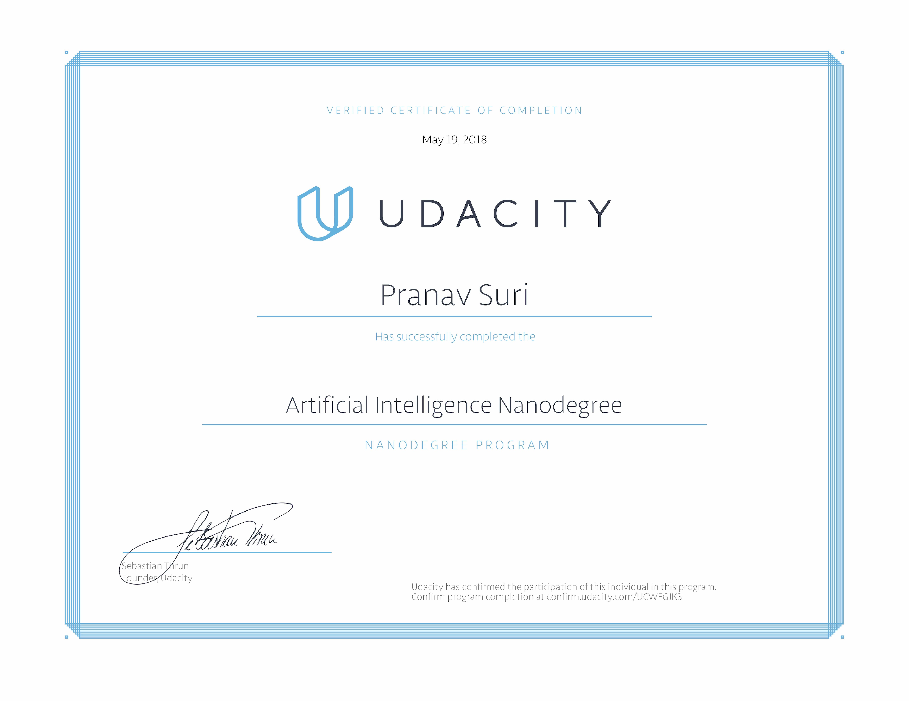

# Udacity: Artificial Intelligence Nanodegree

This repository contains the projects completed as a part of Udacity's [Artificial Intelligence Nanodegree](https://in.udacity.com/course/artificial-intelligence-nanodegree--nd889).

## Contents

### Term-1: Foundations of AI

### [P1: Diagonal Sudoku Solver](https://goo.gl/rqXHwb)
In this project, an extension of a Sudoku solving agent is developed. The project is capable of solving any Classic or Diagonal Sudoku puzzle using three ideas: Constraint Propagation, Search (DFS) and Naked-Twins Strategy.

### [P2: Game Playing Agent (Isolation)](https://goo.gl/ZjWYgv)
This game-playing agent uses techniques such as Iterative Deepening, Minimax, and Alpha-Beta Pruning to compete in the game of Isolation (a two-player discrete competitive game with perfect information). The different heuristics used are then compared to find the best heuristic.

### [P3: Implementing a Planning Search](https://goo.gl/Yjmkp3)
A planning agent was implemented to solve deterministic logistics-planning problems for an air cargo transport system. The underlying logic makes use of a planning graph and A* search with automatically generated heuristics. The results/performance are then compared against several uninformed non-heuristic search methods (BFS, DFS, etc.)

### [P4: American Sign Language Recognizer](https://goo.gl/UJoxXj)
HMMs (Hidden Markov Models) are used to recognize words communicated using the American Sign Language (ASL). The system is trained on a dataset of videos that have been pre-processed and annotated and then tested on novel sequences.

### Term-2: Deep Learning & Applications
On 19th May 2018, opted for the option to graduate from Term-1. Would be learning the Term-2 content through other sources.

## License
[Modified MIT License © Pranav Suri](/License.txt)
