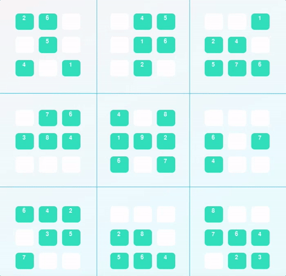

# Diagonal Sudoku Solver
> In this project, an extension of a Sudoku solving agent is developed. The project is capable of solving any Classic or Diagonal Sudoku puzzle using three ideas: Constraint Propagation, Search (DFS) and Naked-Twins Strategy.

## About
[Sudoku](https://en.wikipedia.org/wiki/Sudoku) is one of the world's most popular puzzles. It consists of a 9x9 grid, and the objective is to fill the grid with digits in such a way that each row, each column, and each of the 9 principal 3x3 sub-squares contains all of the digits from 1 to 9. The detailed rules can be found [here](http://www.conceptispuzzles.com/?uri=puzzle/sudoku/rules).

This project solves classic/diagonal Sudoku puzzles using **[Constraint Propagation](https://en.wikipedia.org/wiki/Constraint_satisfaction)** and **[Search (DFS)](https://en.wikipedia.org/wiki/Search_algorithm)**. In addition to the mentioned algorithmic techniques, Sudoku-specific strategy '**[Naked-Twins](http://www.sudokudragon.com/tutorialnakedtwins.htm)**' has also been used.

#### Q: How do we use constraint propagation to solve the naked-twins problem?  
- Constraint propagation works by reducing domains of variables, strengthening constraints, or creating new ones. This leads to a reduction of the search space, making it faster to use search algorithms to traverse for the solution.

- The naked twins problem refers to the situation when two boxes within the same unit (row, column, square or diagonal) have the same two possible numbers that can be filled in them. When this happens, as no other number can go in those boxes, those two numbers can't go anywhere else either. This means they can be safely removed from the possibilities on any other box that belongs to the same unit.

- In this process, an additional constraint can be added that allows further reduction of the possible digits that can fill the sudoku grid. This shortens the recursion towards the solution.

#### Q: How do we use constraint propagation to solve the diagonal sudoku problem?  
- To solve diagonal sudoku, an additional constraint added by the addition of the two diagonals to unit-list. By constituting the necessary constraint which combined with Depth First Search & other reductions,  feasible solution to the diagonal Sudoku is produced.

## Requirements
This project requires **Python 3**. It is recommended to use [Anaconda](https://www.continuum.io/downloads), a pre-packaged Python distribution that contains all of the necessary libraries and software for this project. Try using the environment provided in this folder.

To see the visualization of Sudoku solving, installation of pygame is a necessity.The installation instructions are available [here](http://www.pygame.org/download.shtml).

## Files
* `solutions.py` – Driver program. Solves the Sudoku.

* `sudoku.py` – Consists of a class 'Sudoku' which contains all method definitions used for solving.

* `solution_test.py` – To test the solution.

* `PySudoku.py` – Code for visualizing the solution.

* `visualize.py` – Code for visualizing the solution.

* `Classic_Sudoku.py` – Solver for classic sudoku.

## Example:
#### Classic_Sudoku Solver
```
python classic_sudoku.py

Enter the Soduko values row-wise.

An example is given below:
..3.2.6..9..3.5..1..18.64....81.29..7.......8..67.82....26.95..8..2.3..9..5.1.3..

Enter the Soduko string:
..3.2.6..9..3.5..1..18.64....81.29..7.......8..67.82....26.95..8..2.3..9..5.1.3..

. . 3 |. 2 . |6 . .                4 8 3 |9 2 1 |6 5 7
9 . . |3 . 5 |. . 1                9 6 7 |3 4 5 |8 2 1
. . 1 |8 . 6 |4 . .                2 5 1 |8 7 6 |4 9 3
------+------+------              -------+------+------
. . 8 |1 . 2 |9 . .                5 4 8 |1 3 2 |9 7 6
7 . . |. . . |. . 8                7 2 9 |5 6 4 |1 3 8
. . 6 |7 . 8 |2 . .                1 3 6 |7 9 8 |2 4 5
------+------+------              -------+------+------
. . 2 |6 . 9 |5 . .                3 7 2 |6 8 9 |5 1 4
8 . . |2 . 3 |. . 9                8 1 4 |2 5 3 |7 6 9
. . 5 |. 1 . |3 . .                6 9 5 |4 1 7 |3 8 2
```

#### Diagonal_Sudoku Solver
To run the code, edit the Sudoku string in `solutions.py` and run the script.



## Future Improvements
This was my favorite project of the nanodegree program. There is a lot that I would love to add to take this project and my learning experience further. Some of the ideas are:

- Receiving input from a camera.
- Extending the project to more Sudoku formats.
- Incorporating more Sudoku solving techniques.

If you want to contribute to the above ideas, feel free to reach out to me or use my code to build your own fork.

## License
[Modified MIT License © Pranav Suri](/License.txt)
